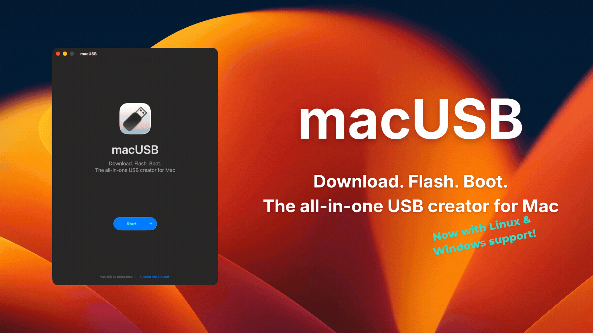
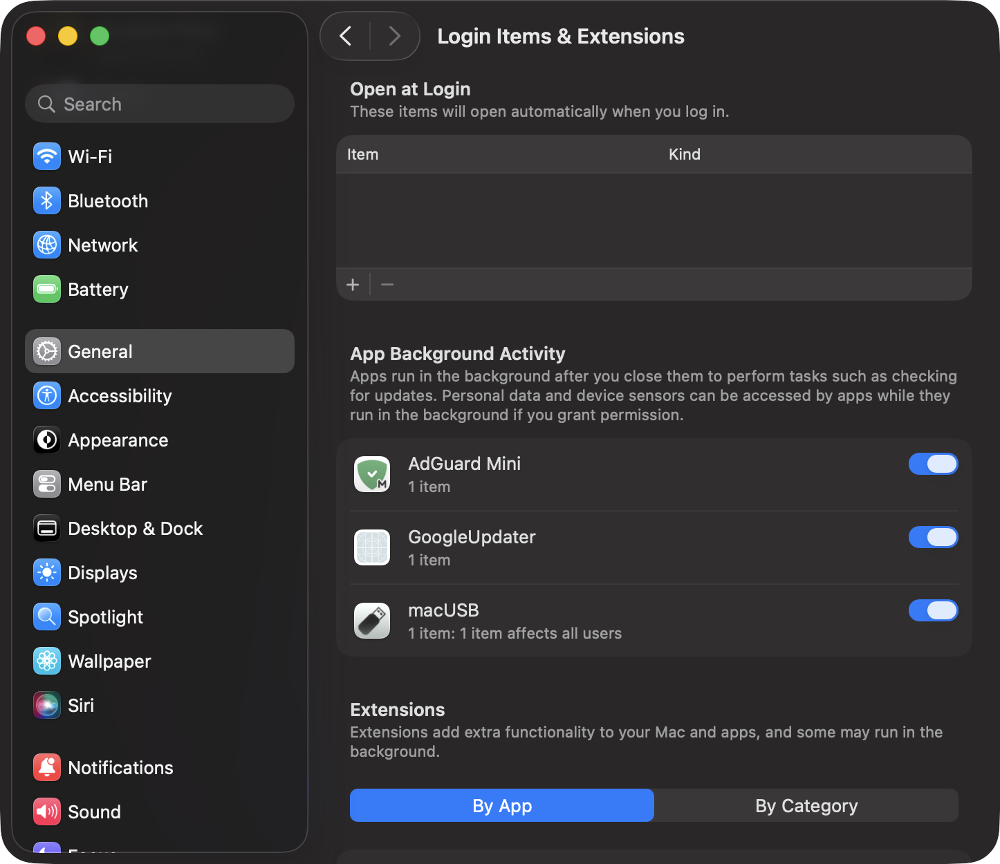
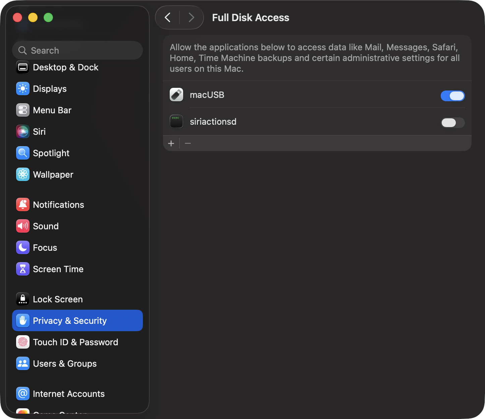
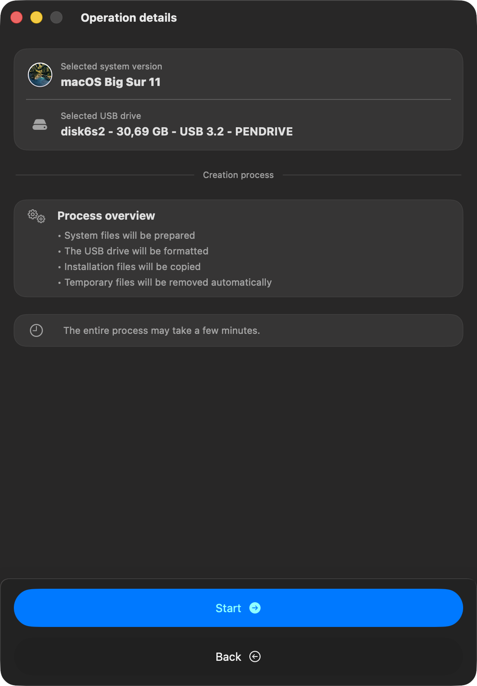
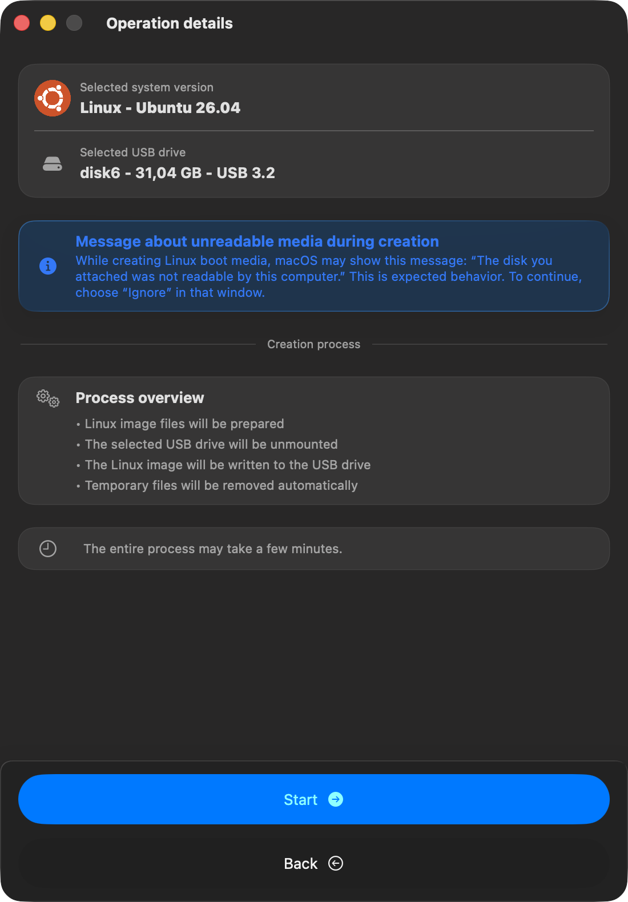
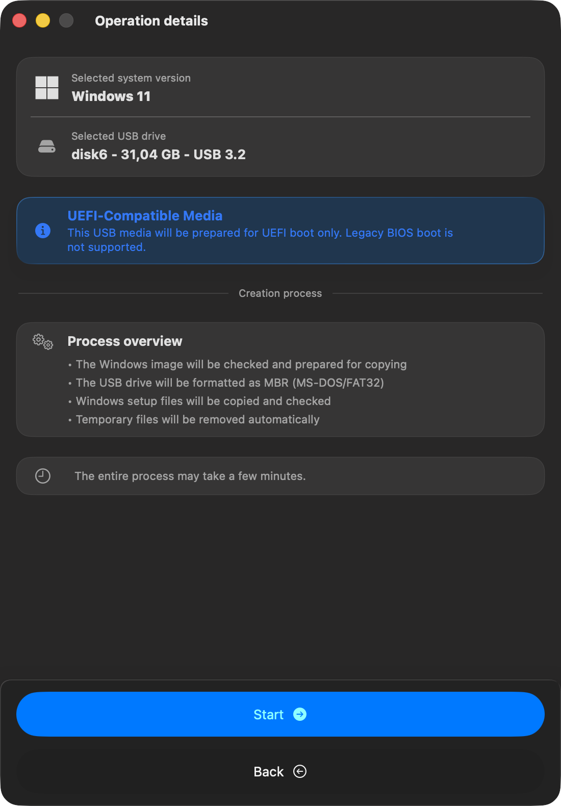

#  macUSB

### Download. Flash. Boot. The all-in-one USB creator for Mac

    [](https://kruszoneq.github.io/macUSB/)

**macUSB** is a guided macOS app for creating bootable USB media on Apple Silicon and Intel Macs from local `.dmg`, `.iso`, `.cdr`, and `.app` files, or with the built-in macOS downloader.

---

<p align="center">
  
</p>

---

## ☕ Support the Project

**macUSB is and will always remain completely free.** Every update and feature is available to everyone.  
If the project helps you, you can support ongoing development:

<a href="https://www.buymeacoffee.com/kruszoneq" target="_blank"></a>

---

## 📥 How to Download macUSB

Choose one installation method:

1. **GitHub Releases:** [Download latest release](https://github.com/Kruszoneq/macUSB/releases/latest)
2. **Homebrew:**

```bash
brew install --cask macusb
```

**Project website:** [macUSB](https://kruszoneq.github.io/macUSB/)

---

## 🔍 Why macUSB Exists

As Apple Silicon Macs became the default host machines, creating bootable USB installers for **macOS Catalina and older** turned into a recurring support issue.

Common problems reported across forums and guides include:
- codesign and certificate validation failures on legacy installer paths,
- version-dependent compatibility constraints and tooling differences on newer hosts,
- manual terminal workflows that are easy to misconfigure and hard to verify.

**macUSB was built through practical research and validated solutions** developed during repeated troubleshooting of these legacy installer scenarios.

As adoption grew and feedback continued to come in, especially through Reddit discussions, macUSB expanded beyond legacy macOS USB creation. The app now includes a built-in macOS downloader and support for creating bootable Linux and Windows media, evolving into a more complete all-in-one tool for bootable USB workflows on Mac.

---

## ✅ Key Features

- **Built-in Downloader:** discover and download macOS installers available from Apple servers.
- **Local source support:** create bootable USB media from local `.dmg`, `.iso`, `.cdr`, and `.app` files.
- **One guided flow:** from source selection or download to finished bootable media.
- **Apple Silicon legacy support:** automatic compatibility handling for older macOS installers during USB creation.
- **Automatic media prep:** partition and format checks with conversion when required.[^1]
- **Linux and Windows support:** create bootable USB media from supported Linux and Windows `.iso` images.

[^1]: When creating macOS bootable media, APFS-formatted targets are not converted automatically. If the selected drive uses APFS, macUSB requires manual reformatting in Disk Utility before continuing.

---

## ⚡ Quick Start

1. Install macUSB using one of the methods listed in **How to Download macUSB**.
2. Open macUSB and either:
   - choose a local source image or installer (`.dmg`, `.iso`, `.cdr`, or `.app`), or
   - use the built-in Downloader to fetch a macOS installer from Apple.
3. Select the target USB drive and review the operation details.
4. Start the process and monitor bootable media creation stage by stage.
   - ***All data on the selected USB drive will be erased.***
5. Use the final result screen for next steps.

> [!IMPORTANT]
> macUSB requires two mandatory permissions for reliable bootable media creation: **enable Allow in the Background for macUSB** and **enable Full Disk Access for macUSB** in System Settings. Without these permissions, helper workflows may fail.

<table align="center">
  <tr>
    <td align="center" valign="top">
      <strong>Allow in the Background</strong><br>
      <a href="docs/readme-assets/permissions/allow-in-the-background.png">
        
      </a><br>
      <sub>General → Login Items &amp; Extensions</sub>
    </td>
    <td align="center" valign="top">
      <strong>Full Disk Access</strong><br>
      <a href="docs/readme-assets/permissions/full-disk-access.png">
        
      </a><br>
      <sub>Privacy &amp; Security → Full Disk Access</sub>
    </td>
  </tr>
</table>

---

## 🧭 Workflow Details

<p align="center">
  Click any screenshot to open full size.
</p>

<table align="center">
  <tr>
    <td align="center" valign="top">
      <strong>macOS Installer</strong><br>
      <a href="docs/readme-assets/app-screens/workflow-macos-details.png">
        
      </a><br>
      <sub>Review the selected macOS version, target USB drive, and creation steps before starting.</sub>
    </td>
    <td align="center" valign="top">
      <strong>Linux Image</strong><br>
      <a href="docs/readme-assets/app-screens/workflow-linux-details.png">
        
      </a><br>
      <sub>Linux workflow includes guidance for the expected unreadable-disk prompt shown by macOS during creation.</sub>
    </td>
    <td align="center" valign="top">
      <strong>Windows Installer</strong><br>
      <a href="docs/readme-assets/app-screens/workflow-windows-details.png">
        
      </a><br>
      <sub>Windows workflow highlights UEFI-only media preparation and the MBR/FAT32 target format.</sub>
    </td>
  </tr>
</table>

---

## 🌐 Downloader Workflow

<p align="center">
  Click any screenshot to open full size.
</p>

<table align="center">
  <tr>
    <td align="center" valign="top">
      <strong>1. Installer List</strong><br>
      <a href="docs/readme-assets/app-screens/downloader-list.png">
        
      </a><br>
      <sub>Browse macOS installers available from Apple servers.</sub>
    </td>
    <td align="center" valign="top">
      <strong>2. Download Progress</strong><br>
      <a href="docs/readme-assets/app-screens/downloader-process.png">
        
      </a><br>
      <sub>Track download and preparation progress in real time.</sub>
    </td>
    <td align="center" valign="top">
      <strong>3. Download Summary</strong><br>
      <a href="docs/readme-assets/app-screens/downloader-summary.png">
        
      </a><br>
      <sub>Review the final status and use the installer in the creation flow.</sub>
    </td>
  </tr>
</table>

---

## ⚙️ Requirements

### Host Computer
- **Architecture:** Apple Silicon or Intel.
- **System:** **macOS 14.6 Sonoma** or newer.
- **Free disk space:**
  - **Downloader stage:** up to **45 GB**, depending on the selected macOS version.
  - **macOS USB creation stage:** up to **20 GB**, depending on the selected source and system version.

### USB Media
- **For macOS installers:** at least **16 GB**; **32 GB minimum** for **Sequoia and newer**.
- **For Windows/Linux images:** **8 GB** or more, depending on the size of the selected `.iso` image.
- **Performance:** USB 3.0+ is recommended.

> [!NOTE]
> External HDD/SSD support is disabled by default on every app launch to improve safety and reduce the risk of accidental target selection. You can enable it in **Options** → **Enable external drives support**.

### Source Inputs
macUSB can work with either local source files or the built-in macOS Downloader.

Accepted local source formats depend on the system recognized in the selected source:
- **For macOS:** `.dmg`, `.cdr`, `.iso`, and `.app`
- **For Windows/Linux:** `.iso`

---

## 💿 Supported macOS Installers

macOS versions recognized and supported for USB creation:

| System | Version | Supported |
| :--- | :--- | :---: |
| **macOS Tahoe** | 26 | ✅ |
| **macOS Sequoia** | 15 | ✅ |
| **macOS Sonoma** | 14 | ✅ |
| **macOS Ventura** | 13 | ✅ |
| **macOS Monterey** | 12 | ✅ |
| **macOS Big Sur** | 11 | ✅ |
| **macOS Catalina** | 10.15 | ✅ |
| **macOS Mojave** | 10.14 | ✅ |
| **macOS High Sierra** | 10.13 | ✅ |
| **macOS Sierra**[^2] | 10.12 | ✅ |
| **OS X El Capitan** | 10.11 | ✅ |
| **OS X Yosemite** | 10.10 | ✅ |
| **OS X Mavericks**[^3] | 10.9 | ✅ |
| **OS X Mountain Lion** | 10.8 | ✅ |
| **OS X Lion** | 10.7 | ✅ |
| **Mac OS X Snow Leopard** | 10.6 | ✅ |
| **Mac OS X Leopard** | 10.5 | ✅ |
| **Mac OS X Tiger**[^4] | 10.4 | ✅ |

[^2]: Only **10.12.6** is supported.
[^3]: Fully verified with the image from [Mavericks Forever](https://mavericksforever.com/). Other sources may fail.
[^4]: **Single-DVD** images are auto-detected. For **Multi-DVD** images, only the first disc is recognized correctly. Other discs may appear as unrecognized or be identified incorrectly. To use them, force detection manually from **Options** → **Skip file analysis** → **Mac OS X Tiger 10.4 (Multi DVD)**.

---

## 🪟 Windows Support

macUSB recognizes Windows `.iso` images starting from **Windows XP** and **Windows Server 2003**.

Bootable Windows USB creation is currently supported for **Windows 8 and newer** and **Windows Server 2012 and newer**. Prepared media is **UEFI-only**.[^5]

When a Windows image is recognized, macUSB detects the edition automatically. For ARM builds, the architecture is labeled directly in the detected name, for example `Windows 11 (ARM)`.

During Windows USB creation, macUSB formats the selected target as **MBR** with **FAT32**. Because FAT32 has a **4 GB per-file limit**, some modern Windows images may require extra preparation. If `install.wim` exceeds that limit, macUSB automatically splits it into smaller `.swm` parts using `wimlib`.

> [!IMPORTANT]
> [`wimlib`](https://wimlib.net/) is required only when the selected Windows image needs `install.wim` splitting. It is not bundled with macUSB and must be installed separately by the user. The simplest install path is Homebrew:
>
> ```bash
> brew install wimlib
> ```
>
> macUSB checks automatically whether `wimlib-imagex` is available when this step is required.

[^5]: Booting and installation were tested on a Dell OptiPlex 5040 with UEFI and Secure Boot enabled.

---

## 🐧 Linux Support

macUSB also supports creating bootable USB media from Linux `.iso` images.

When a Linux image is recognized, macUSB detects the distribution, version, and architecture automatically. ARM builds are labeled directly in the detected name, for example `Linux - Ubuntu 26.04 (ARM)`.

If a selected file is a valid Linux image but is not recognized automatically, you can force Linux mode manually from **Options** → **Skip file analysis** → **Linux**.

> Linux support has been tested with 19 distributions using the latest available releases as of April 30, 2026, with boot behavior verified on real hardware.[^6]

[^6]: Validated distributions: *Ubuntu*, *Kali Linux*, *NixOS*, *Garuda Linux*, *openSUSE Leap*, *Gentoo*, *Rocky Linux*, *Linux Mint*, *Fedora Workstation*, *Manjaro*, *Zorin OS*, *CachyOS*, *AlmaLinux*, *Debian*, *Arch Linux*, *MX Linux*, *Pop!_OS*, *EndeavourOS*, and *elementary OS*. Boot behavior was verified on a MacBook Air 2017, a Dell OptiPlex 5040 with UEFI, and an Asus F52Q with Legacy BIOS.

---

## 🧩 PowerPC Notes

If you are reviving a PowerPC Mac, the project website includes a dedicated Open Firmware guide based on real boot testing of PowerPC USB workflows created with macUSB.

Validated scenarios include:
- **Mac OS X Tiger** and **Mac OS X Leopard** boot scenarios,
- **Single DVD** editions, and for Tiger also the **Multi-DVD** path,
- Open Firmware boot commands verified in real hardware tests, including an **iMac G5**.

Use the [step-by-step guide](https://kruszoneq.github.io/macUSB/pages/guides/ppc_boot_instructions.html) for setup and boot instructions.

> PowerPC USB boot behavior can vary by model. During validation testing, USB boot was confirmed on an **iMac G5**, while an **iBook G4 (2003)** detected the USB device but did not boot from it successfully.

---

## 🌍 Available Languages

The interface follows system language automatically:

- 🇵🇱 Polish (PL)
- 🇺🇸 English (EN)
- 🇩🇪 German (DE)
- 🇯🇵 Japanese (JA)
- 🇫🇷 French (FR)
- 🇪🇸 Spanish (ES)
- 🇧🇷 Portuguese (PT-BR)
- 🇨🇳 Simplified Chinese (ZH-Hans)
- 🇷🇺 Russian (RU)
- 🇮🇹 Italian (IT)
- 🇺🇦 Ukrainian (UK)
- 🇻🇳 Vietnamese (VI)
- 🇹🇷 Turkish (TR)

---

## 🛠️ Diagnostics & Support

If you need help with macUSB or want to report a problem, use [GitHub Issues](https://github.com/Kruszoneq/macUSB/issues).

Before opening an issue:
- check whether the same problem has already been reported,
- choose the issue template that best matches your case,
- attach diagnostic logs exported from `Help` → `Export diagnostic logs...`,
- attach screenshots showing the issue.

---

## ⚖️ License

Licensed under the **MIT License**.

Copyright © 2025-2026 Krystian Pierz
